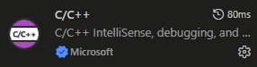
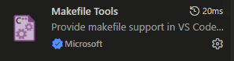
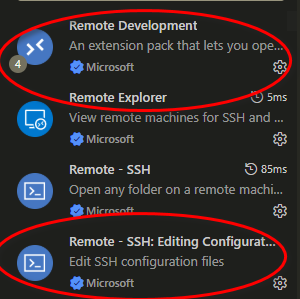
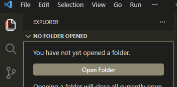
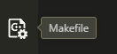
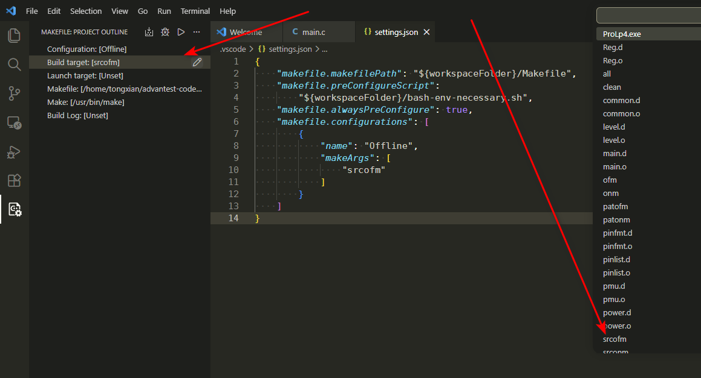
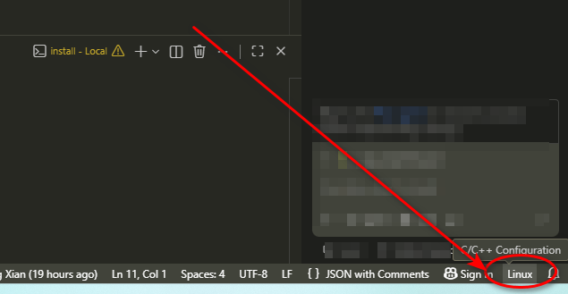
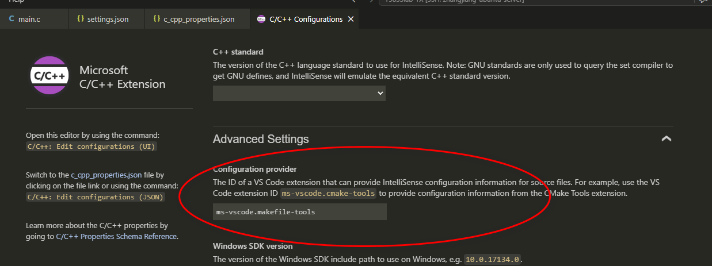
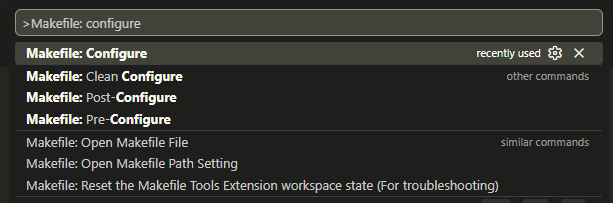
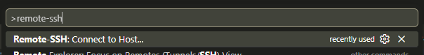

# ReadMe: VSCode开发环境搭建记录

当前状态：VSCode的代码阅读环境搭建完毕，代码撰写时候的自动补全功能也是完整的了。
> [!Warning]
> 由于还没有offline的license，测试机紧密联系的一套工具程序不一定能跑起来（未作测试），现在搭建起来的有C代码阅读、C语言跳转等“只读”功能以及代码撰写时候的自动补全、intellisense等功能。后续的开发环境搭建待有了license之后再继续。

> [!Tip]
> T5833的开发环境在linux下，在实际使用中，可用VSCode（微软版本）+remote插件、并且有linux的机器的前提下，实现“windows下VSCode远程进行linux开发”的功能；有一些约束条件，文档后半部分详述。

---

## 外围环境准备

### VSCode环境准备

1. VSCode版本：本次搭建试验，使用VSCode的微软版而非开源版VSCodium，使用最新版本`VSCode 1.129.1`进行的试验；
2. VSCode插件准备：需要安装如下插件：
   * :large_orange_diamond:**（必须）** `C/C++`插件，VSCode的`extensions: marketplace`中使用`C/C++`关键字搜索，选择`Microsoft`出品的插件即可，截图示例：  
        
      安装插件的时候可以核对如下信息：
        * 插件ID：`ms-vscode.cpptools`，这里给出作为核对信息使用，也可以使用作为搜索关键字；
        * url链接（注意，这是给出是为了方便核对信息的，不建议从链接下载文件安装，而是应该从VSCode里面搜索安装）：<https://marketplace.visualstudio.com/items?itemName=ms-vscode.cpptools> 。

   * :large_orange_diamond:**（必须）** `Makefile Tools`插件，使用`Makefile Tools`作为关键字搜索w，选择`Microsoft`出品的插件即可，截图示例：  
        
      安装插件的时候可以核对如下信息：
        * 插件ID：`ms-vscode.makefile-tools`；
        * url链接：<https://marketplace.visualstudio.com/items?itemName=ms-vscode.makefile-tools> 。

   * :large_blue_circle:（可选） vim插件，VSCode安装了vim插件之后操作变为vim模式，可以实现与线下培训课上讲解的vim快捷键相同操作。
        * 插件ID：`vscodevim.vim`；
        * url链接：<https://marketplace.visualstudio.com/items?itemName=vscodevim.vim> 。
  > [!Note]
  > 考虑到vim模式下的操作学习曲线过于陡峭，此次搭建试验不使用vim插件。 这里列举出来纯粹是因为线下培训用的vim。

   * :red_circle:（如果只进行本地开发则不需要，如果要进行后半部分详述的**远程开发**，则是**必须**） remote开发系列插件，使用`remote extensoin pack`关键字搜索，安装扩展包；并且安装`Remote - SSH: Editing Configuration Files`单独插件，截图示例：  
        
        * 扩展包ID：`ms-vscode-remote.vscode-remote-extensionpack`；
        * url链接：<https://marketplace.visualstudio.com/items?itemName=ms-vscode-remote.vscode-remote-extensionpack> 。
        * 插件ID：`ms-vscode-remote.remote-ssh-edit`
        * 插件url链接：<https://marketplace.visualstudio.com/items?itemName=ms-vscode-remote.remote-ssh-edit> 。

### linux系统环境准备

> [!Warning]
> 再次提醒，在该阶段还没有offline的license，现在只搭建C代码阅读、C语言跳转等“只读”功能的环境。

1. 机台开发环境搭建：C的系列include文件夹，解压复制（:warning:没有offline license，因此特意避开了“安装”这个术语）到一个指定目录。压缩包从`<ftp_server>/3.培训教程资料/T5833培训-202607/opt_ATFS_archive_fromVM.tar.xz`下载。解压之后，将子目录`ATFS`放入一个位置，记为`<ATFS_root_dir>`。本次搭建试验的ATFS根目录为`/opt/ATFS`。
2. bash环境变量：所有ATFS相关的环境变量放在了该repo的`bash-env-necessary.sh`文件中。该文件设计使用方式为`source bash-env-necessary.sh`。本次搭建试验，该文件配置的环境变量取`<ATFS_root_dir> = /opt/ATFS`。

  > [!Note]
  > :notebook: 本次搭建试验是C代码阅读、C语言跳转等“只读”功能，因此在VSCode的环境下，这个文件无需进行source，但如果是需要进行命令行操作，则需要保证文件内出现的环境变量在bash下都已经有定义。  
  > :notebook: 待机台设备进来、厂家给安装配置好linux开发环境之后，这些环境变量在机台的linux电脑上大概率是都已经配置好的无需自行解决，如果厂商未搭建好这个小概率事件发生，才需要对这个文件进行source；这个文件是自行搭建offline和VSCode环境使用的。

4. `ctags`命令安装：使用安装的linux发行版的包管理器进行安装，本次搭建试验安装的是`universal-ctags`这个软件包，程序的命令行调用是`ctags`命令。
5. C/C++开发系列软件安装：包括`gcc`、`make`等命令。

---

## 开发环境搭建

> [!Note]
> 以下步骤使用该repo为例进行试验，搭建是成功的。

1. 在VSCode中，使用`open folder`打开代码目录到workspace中：  
     
   代码目录在根目录下应该包含1个`Makefile`文件。  
   此时，安装的`ms-vscode.makefile-tools`插件应该能自动激活，并且出现在左侧边栏：  
     
   `ms-vscode.cpptools`激活时不会出现在左侧边栏，因此暂时不用看。

2. 配置Makefile Tools:
   1. 在代码目录下建立`.vscode`文件夹，新建`settings.json`文件，填写以下配置（写完不要忘记保存）：

      ```json
      {
         "makefile.makefilePath": "${workspaceFolder}/Makefile",
         "makefile.preConfigureScript":
            "${workspaceFolder}/bash-env-necessary.sh",
         "makefile.alwaysPreConfigure": true,
         "makefile.configurations": [
            {
               "name": "SrcOffline",
               "makeArgs": [
                   "srcofm"
               ]
            }
         ]
      }
      ```

  > [!Note]
  > 注意，这里是用例程的`Makefile`里面的`srcofm`这个target做的试验，其余的target这次未作试验，但同理。

  > [!Warning]
  > `bash-env-necessary.sh`这个文件，虽然不需要source，但是在这里还是需要用到的。

   2. 点开Makefile Tools左边栏的按钮，看各个配置是否与截图中左半部分一致，如果一致则不要动，否则使用下拉菜单选择为一致：  
      

   3. 从右下角点开C/C++ configuration：  
        
      在配置界面，`Advanced Setting`下，`Configuration provider`填写`ms-vscode.makefile-tools`：  
        
      等待1秒左右，插件配置自动保存。保存之后应该自动生成`.vscode\c_cpp_properties.json`文件。

   4. :bangbang: 代码的`Makefile`文件：该例程是线下培训给出的，代码根目录的`Makefile`有点不规范需要修改一下：  
      :reminder_ribbon: 把`Makefile`中，使用的裸`make`命令，都换成`$(MAKE)`这个内置变量。
  > [!Caution]
  > 从本repo已有代码中可以看出来，这里只替换了`srcofm`这个目标下的命令，其余的未作修改，因此在上面才有强调说“是用例程的`Makefile`里面的`srcofm`这个target做的试验”。

   5. 至此，可以在`F1`下拉菜单中执行`Makefile: Configure`命令，完成配置：
      

## VSCode远程开发配置

> [!Note]
>
> ### 一些优缺点：
>
> #### 优点 :thumbsup:
>
> * VSCode可以跑在本地，使用自己搭配好的熟悉的外围环境；
> * 在远端机器上只有`vscode-server`在运行，远端机器不需要处理图形操作，网络传输也不需要传输图形图像；
> * VSCode可以使用功能更强大、生态更加丰富的新版本，不会被远端机器掐死，插件的安装、配置也可以直接在extension market上直接搜索安装，更方便。
>
> #### 缺点（使用约束）:biohazard:
>
> * 远端计算机还是需要跑`vscode-server`这个程序，而极其老旧的linux发行版有可能会出现安装的`glibc`版本和提供的`ABI`版本过低、无法满足该程序的依赖、该程序无法运行的情况。

配置步骤：

0. 确保`remote extensoin pack`已经安装，主要使用`Remote - SSH`组件；

1. 使用`~/.ssh/config`（windows也有这个文件，并且在类似位置）配置好远程服务器的ssh登录，建议使用公钥登录方式；具体配置方法可以在网上搜索；

2. 使用VSCode的`F1`下拉菜单，选择`Remote-SSH: connect to host`连接远端机器：
   
   点击之后，会出现`~/.ssh/config`中配置的主机，选择即可；

3. 在VSCode内进行文件操作，打开目录、打开文件、编辑文件保存等。

## 配置完毕之后的效果

### 代码阅读和跳转：


### 写代码时候的自动补全


> [!Tip]
> 这里记录的搭建过程，在有了license之后的正式开发工作中也是可以用的，把机台的软件安装步骤替换为机台软件安装手册的正规安装步骤、配置好`license server`即可。
> 但本次搭建过程由于缺少license未作相应试验，因此现在应该看作只有代码阅读和代码撰写功能，构建功能视为没有。

> [!Caution]
> 这次搭建试验是在`Ubuntu 24.04`的机器上试验的，发行版的这个版本兼容现在的主流软件生态，因此搭建过没有什么恶心人的事情。
> 如果在极其老旧的发行版上，有可能会遇到主流软件兼容的问题，运行时ABI版本导致的，这点要注意。
